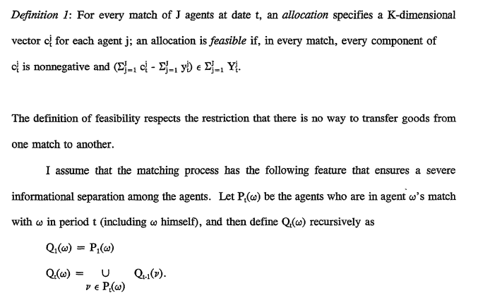

#Money is Memory

Last week I examined Bitcoin through the classical characteristics of money: portability, acceptance, etc. Bitcoin did not settle into the model well, but I jammed it into the accepted definition anyways to create the starting point for a discussion. You can read [that analysis here](http://roymurdock.com/essays/2014/04/bitcoin-and-classical-economics/).

This week I want to examine a more progressive monetary model. I will use it to think about Bitcoin and currency in general. I posit that this new view of money perfectly explains the efficiency gains of a blockchain-based currency.

I will then present a use-case for the efficiency gains realized in a Bitcoin system, while addressing but not analyzing the ethical and political implications of a government version of Bitcoin.

##Classical Ideas of Money

To recap last week’s analysis: the general understanding of money is that it serves three functions: store of value, medium of exchange, and unit of account. Certain properties of the way it is recorded (portability, fungibility, divisibility, etc.) allow it to fulfill these functions. For the USD, we examined the weight and size of the paper, the cost of printing and replacing bills, and the counterfeiting measures, among other characteristics of paper money.

Some of these properties simply don’t apply to Bitcoin and virtual currency in general. For example: portability. It was an important property in the past (cattle vs. cash), but it is not entirely relevant to an intangible form of currency.

How are we supposed to think about the portability of a bitcoin? It’s not something we physically own and carry with us. A bitcoin exists as data on server, 0’s and 1’s expressed by thousands of tiny transistors - not as paper in my pocket. A bitcoin is as portable as the device it is accessed and spent with.

We need a new definition to work with.

##A New Definition of Money

I recently attended a talk given by the [knowledgeable Garrick Hileman](http://www.garrickhileman.com/) who is due to publish a paper on virtual currency in the near future. After some skeptical questions on the viability of Bitcoin, he asked the audience (a large group of eager young economics students) the following question:

>“What is money?""

He got the standard first year econ student exam response:

>“Well it’s defined as a medium of exchange, a store of value, and a unit of account.”

His response stumped me. At first it might seem like a strange assertion, but it begins to feel weirdly intuitive the more you play with it.

>**“Money is memory.”**

A brilliant economist named Narayana N. Kocherlakota, of the Federal Reserve Bank of Minneapolis [wrote a paper](http://www.minneapolisfed.org/research/sr/sr218.pdf) by the same name in 1996: it was his work that Mr. Hileman was referencing.

I’m baffled as to why I’ve never heard of this idea in any of the economics courses I’ve taken. Maybe it hasn’t gained widespread recognition yet, or maybe it’s just easier to explain the three functions of money than to go through some of the mathematics required to rigorously prove such a simple statement.

From the abstract: 
>The main proposition proves that any allocation that is feasible in an environment with money is also feasible in the same environment with memory. Depending on the environment, the converse may or may not be true. Hence, from a technological point of view, money is equivalent to a primitive form of memory.

How is memory defined?

>Memory is defined as knowledge on the part of an agent on the full histories of the agents with whom he has had direct or indirect contact in the past.

Sound familiar? This is an exact definition of the blockchain, the backbone of Bitcoin and the innovation behind every virtual currency in existence today.

##Cash Tokens vs. Digital Tokens

If you think about it, cash is simply a token that represents the memory of a transaction.

Let’s say I pay you $20 for an apple. I receive the apple and you receive a token (the $20 bill) that society has appointed a specific value. Someone else in our society recognizes the value of your hard work, represented by that $20 bill. Present them with the cash, the token, the memory of the transaction, and you are repaid for your gift of the apple to me with another good that you desire.

Money is a physical placeholder. Bitcoin is a virtual placeholder. The virtual trade of placeholders has many advantages over the restrictions of the physical world.

The inability for others to cheat through double-spending is also a huge advantage of perfect memory. A double-spending attack (using 51% of a [ridiculous amount](http://www.coindesk.com/data/bitcoin/) of computational power) is extremely unlikely.

>It is often asserted (for example, in the Bitcoin white paper [22]) that a
cartel can double-spend Bitcoins. In a strict sense, this is true: a cartel can
spend a Bitcoin by paying it to a player Alice, receiving goods or services, and
then shifting the consensus choice of history to a branch where that coin is instead paid to a different player Bob. However, we argue that double-spending
by a cartel has a limited payoff. Bitcoins have value because people are willing to trade them for goods and services. If players were unwilling to accept Bitcoins for trade or unwilling to spend Bitcoins for fear of having their payments nullified, the value of Bitcoins would diminish significantly as players lost
confidence in the system. 

>Worse, because players are encouraged to generate a
new identity for each transaction and because identities are not linked to any
side information, players cannot easily determine whether a proffered payment
is coming from the double-spending cartel or an honest user. Thus, a rational
player should refuse to accept any payments when there is a significant threat
of double-spending. As a cartel must outmine the entire Bitcoin network and
thus outspend the entire Bitcoin network for as long as it would remain a cartel,
we believe it is very unlikely that a cartel could double-spend enough to recover
the cost of the attack.[^1]

##Anonymity

Economically, the blockchain is the revolutionary digital ledger that makes memory storage and retrieval dramatically more efficient. Whether or not the storage and exchange should be anonymous is a question of politics and beliefs, one that is rooted in the "ephemera that people have constructed on top of currency," (i.e. financial intermediaries and the government).

To this end I wish to point out the two separate debates that are included in every piece of Bitcoin literature: efficiency and anonymity. They are usually inextricably fused together for no good reason.

**Efficiency:** Bitcoin is a more effective and perfect form of memory, therefore it is a better form of currency than paper money. 

**Anonymity:** There is nothing about the design of the blockchain that specifies that the users of a virtual currency must be anonymous. Many people get the wrong idea that anonymous, shady transactions are the only reason that people use Bitcoin. This is simply not true. 

Paper cash is also (99%) anonymous, so there isn’t much more incentive to pay your local drug dealer in cash than in BTC. It simply allowed geographically agnostic black markets to develop around drugs and "hitmen". These markets gained notoriety, which the media was quick to capitalize on. The general public now thinks of Bitcoin as a better way to buy drugs, when in fact it is much more than that.

##What if the Government Adopted Bitcoin?

Consider this use-case of Bitcoin: efficient tax collection and monitoring of the economy. In an economy where the majority of trade is conducted in Bitcoin, with every citizen having a mandatory account that is linked to his/her reputation, every single transaction could be monitored and processed by the government. All income would be declared, and every single legal purchase or sale would be referenced in the blockchain. This would save the government and the honest taxpayers millions by preventing tax fraud (undeclared gains, tips, cash transactions) as well as eliminating the need for costly and potentially [deficient audits](http://blogs.wsj.com/cfo/2014/01/24/one-in-three-audits-fail-pcaob-chief-auditor-says/).

As long as laws are enforced, a shadow economy will exist. Paper cash (or perhaps a secondary, anonymous virtual currency) would be used to satisfy the demand for illegal goods. It is likely that public opinion would be so against this type of monitoring that cash itself would become extremely valuable, as people would revert to cash and barter systems in order to avoid the prying eyes of the government.

Is it possible for the government to implement Bitcoin? Is a more efficient system socially acceptable? As the manufacture and spread of information becomes more efficient, how will society deal with the increasingly hard-to-ignore shadowy areas of drugs, prostitution, slavery, and corruption? Only time can tell.

##In Summary

The blockchain supports a system with a more perfect form of memory than the paper currency system; as such, digital currency is a more efficient form of money because it requires less trust and solves notable incentive problems.

Any talk of Bitcoin is bound to rile up political and ethical debates. The subject of political debates is generally anonymity and its implications. An anonymous system would subvert government control and power over the economy.

Anonymity has always been a topic of debate: Plato discusses invisibility much as we discuss the repercussions of the end of anonymous commenting on Youtube. It is bound to cause controversy wherever it is found.If we move beyond the subjective and divisive topic of anonymity, we find that Bitcoin has the potential to create a more efficient economy through its ingenious, full-ledger design.

##Footnotes

[^1]: Kroll, Joshua A., Ian C. Davey, and Edward W. Felten. [The Economics of Bitcoin Mining in the Presence of Adversaries](https://www.cs.princeton.edu/~kroll/papers/weis13_bitcoin.pdf), pp. 11-12.