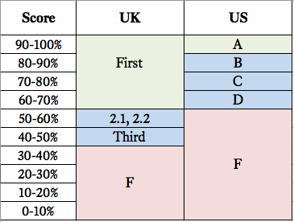
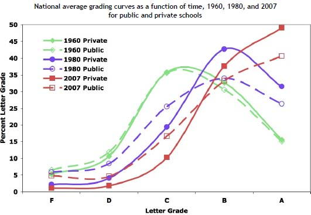
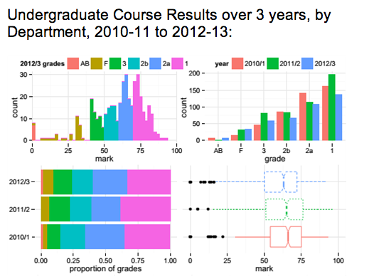

#Some Structural Differences Between UK & US Universities

I spent the past year studying abroad at the London School of Economics - London turned out to be a beautifully diverse, forward-thinking, and interesting city.

Now that it’s over, I want to explore what made my studies at the LSE so much more engaging, challenging, and ultimately rewarding than my studies at Babson College, a small, private business school in the United States.[^1]

In my opinion, the clever design of the UK system of grading and exam assessment:

1. Enforces a **healthier** and more **complete** view of reality than the US system.
2. Incentivizes **higher performance** than the US system.
3. Makes **cheating** near-impossible.

For these reasons, I believe the UK system of grading to be more effective than the US system, leading to a higher quality of education and a more valuable degree.

##Structural Differences

Let’s review the objective differences in the grading scale before I defend my opinions. The highest grade in the UK system, a first, requires a score of 70% or above. Equivalently, a 70% in the states is a C-/D+. Failing grades are 59% and 39% in the US and UK respectively. While the size of the range of passing grades is generally similar (40-70% in the UK vs. 60-100% in the US), there is a large discrepancy at the top of the scale, where it comes to the recognition of excellence. In the UK, raw percentages are converted into titles (first, 2.1, etc). In the US, raw percentages are converted to letter grades, which are then converted into a GPA (A = 4.0, B = 3.3, etc).

The UK has a large range of success (above 70%) whereas the US system has a large range of failure (below 60%).

At the LSE, students take one 3-hour exam per course, which amounts to 4 or 5 final exams. These final exams are the only component of a student’s grade. Homework, class participation, attendance, quizzes, group projects, midterms; the staples of the American system are non-existent at the LSE. The weight of this exam places the test-taker under an immense amount of pressure. One bad exam can render an entire year’s worth of hard work irrelevant. Exam questions can draw from the entirety of the material covered over the course of the year.

The majority of unit or chapter tests in the US cover a few of topics, with midterms and final exams covering their respective halves of the course. The year is split into semesters or trimesters, with the majority of courses spanning one half/one third of the academic year. A final exam for a one-semester course covers 25% of the material of its UK counterpart (1/2 course * 1/2 year = 1/4 material tested).[^2]

These are the objective differences. Lets get on with the subjective analysis.

##1. Dumb Luck

Each exam covers a massive amount of material. It is impossible to master every topic covered in class: only 70% completion is expected for the highest distinction, a first. If you can't study everything, you are forced to make a choice.

Many students choose to specialize in 4 or 5 topics that are likely to appear on the exam. Say you’re taking an economic history course (qualitative).[^3] The exam gives you a choice of 12 essay prompts, 6 of which you must develop into 30-minute essays. The strategy here is to comb through past exams to look for a couple of key characteristics:

1. Topics that appear with the highest frequency
2. Topics you’ve already studied for other classes
3. Topics that haven’t been asked in recent exams
4. Topics that interest you, which will be easier to study

Based on this analysis, you’ll pick your 6 topics. Masterful crammers could get in a couple more, but it is impossible to know every subject at essay-proficient levels, especially with 3 other subjects to revise.Now that you’ve made your choices, the rest depends on luck and the whims of the exam compiler. You hope to see all of your chosen topics prompted in the exam.

##1.1 Benefits of Luck/Choice

I enjoy the luck/choice factor inherently introduced by the assumption that you will be unable to answer a large (30%) portion of the exam. The benefits of luck/choice manifest themselves in 3 ways:

1. Allows for diversity of interest
2. Lessens fear of failure
3. Encourages empathy/reduces entitled mindset

**Diversity of Interest:** Luck/choice encourages interest by allowing a student to focus on specific topics, rather than forcing her to memorize 90-100% of the material, as she would in The States. As one friend put it, “you can get 40% of a UK exam wrong and still walk out with a 2.1 (B+/A-)”. Score a 60% in The States and you walk out with an F.

By expecting students to know 90-100% of the material to achieve an “A”, the US system removes any ambiguity on the choice of topic that you will be studying. You know exactly what will be on the exam, and you know exactly how much of it you must memorize to get your desired grade.

The UK system presents you with a buffet of knowledge, pushing you to sample that one extra topic that lies just beyond what you think you can comfortably retain. The US system forces predetermined topics down your throat, deducting points if you find one topic unbearably boring, overly complex, or simply flawed.

**Fear of Failure:** Ingrained in the US system is the idea that perfection (100%) or total control and mastery of a subject is not simply possible, but routinely expected of good students. When is anything ever 100% complete in the real world? When do we have complete and inexorable control over anything? Psychologically, it feels better to see a big red 100 on the top of your exam and a 4.0 at the top of a transcript. But the idea that perfection can and should be consistently achieved is dangerous. It does not belong in a student's mind.

Greatness is achieved in the pursuit of perfection, but for an educational system to reinforce the idea that your work can and should be consistently close to perfect can cause severely negative reactions to (gasp) **failure**. Failure, that shameful, ignominious event that we are taught to avoid at all costs. Failure, an inevitable part of life that is to be swept under the rug, hidden by a system that punishes what is sometimes unavoidable, completely out of our control. Failure, that event that can either be ignored and repeated, or remembered as a valuable lesson learned the hard way; a lesson that can inform future success.

I don't mean to imply that people **should** fail, only that people **will** fail. I am talking about relative failure, not absolute failure. Getting a B in today's competitive college environment is a relative failure as many highly sought-after jobs screen first and foremost on a GPA cutoff. A UPenn student recently [committed suicide](http://www.nydailynews.com/news/national/upenn-track-star-jumps-death-philadelphia-article-1.1585337) after achieving a 3.5 (A-/B+) in her first semester. Rampant [grade inflation](http://economix.blogs.nytimes.com/2011/07/14/the-history-of-college-grade-inflation/?_php=true&amp;_type=blogs&amp;_r=0) and [cheating](http://web.stanford.edu/class/engr110/cheating.html) exacerbate the problem.

Source: http://www.gradeinflation.com/

Assuming you are well prepared and the exam is fairly written, bad luck should not drop you from a first to a fail. It should mean the difference between a first and a 2.1.

**Empathy & Entitlement**: In her recent [Stanford commencement speech](http://news.stanford.edu/news/2014/june/gates-commencement-remarks-061514.html) Melinda Gates reemphasizes how important the recognition of luck is in keeping us grounded

>Bill worked incredibly hard and took risks and made sacrifices for success. But there is another essential ingredient of success, and that ingredient is **luck** – absolute and total **luck**.

>When were you born? Who were your parents? Where did you grow up? None of us earned these things. They were given to us.

>When we strip away our luck and privilege and consider where we'd be without them, it becomes easier to see someone who's poor and sick and say "that could be me." This is empathy; it tears down barriers and opens up new frontiers for optimism.

Bill &amp; Melinda Gates aren't alone; [Warren Buffet](http://pragcap.com/warren-buffett-on-the-role-of-luck) shares the same sentiments. It's all too easy for the majority of us college students in the United States to forget just how fortunate we are to have the opportunity to spend 4 years and $200k just to learn, while many of our peers may have faced unfortunate familial/financial situations. When we get used to a system in which leaves no room for luck, it becomes easy to adopt an entitled mindset:

>I work hard and prepare myself for my exams. I can and should always do well in my exams (because they are designed to be completed to near-perfection). Therefore, if I work hard later in life, I should always be successful in my career and family life. This is how life is and should be. People who don't achieve success are either lazy or stupid.

As inequality (the [defining challenge of our time](http://www.pbs.org/newshour/rundown/obama-set-to-speak-on-income-gap-between-rich-and-poor/)) grows, [mobility between wealth brackets decreases](http://web.stanford.edu/group/scspi/_media/working_papers/mitnik-cumberworth-grusky_social-mobility-high-inequality.pdf). As mobility decreases, the importance of luck (being born smart, good-looking, white, rich, in the USA) increases. Luck, or undiversifiable (systematic) risk should be accounted for, as it is in the UK system. We should not be misled into thinking that our success is purely a result of hard work and personal. It is, and will always be, a varying combination of effort and luck.

##2. Great Expectations

UK exams reserve the 70-100% range for the recognition of genius and/or mastery of the subject. A common joke at LSE is that “any paper scoring above 90% is basically ready to be published in a journal”. This is not to say that students attempt create new economic models during their exams, but it does imply that a 90% answer will require a thorough understanding of the theory behind the subject, above and beyond the class slides and lecture material. A solid understanding of the material (70%) is still rewarded with the highest distinction; thus impossibly high expectations do not cause grade disinflation or penalties.

LSE Exam Results: No 100% grades awarded.

By requiring “A” students to score 90-100% the US system can often (unintentionally?) reward mediocrity. A system that makes “perfect” attainable and “near perfect” expected of an A student removes any incentive to reach outside the scope of the exam. Expectations of what a student can and should be able to know, recite, and synthesize on an exam are lower. Lower expectations lead to lower achievement.

There is also the fringe case of the truncation in the distribution of grades in the US system. Nobody gets 100 at the LSE, so everyone's academic ability is represented within the distribution. Students who achieve a 4.0 GPA are not accurately distributed, as they are limited by an upper bound on the GPA. Therefore, it is impossible to recognize differences in excellence within this elite group of achievers. Of course, there are other lines in a resume, and this is an extremely fringe case, but it's worth noting nonetheless.

##3. No Cheating

I am going out on a (very sturdy) limb and positing that [cheating](http://www.nytimes.com/2013/05/09/nyregion/at-barnard-college-reports-of-cheating-prompt-changes.html?_r=0) is [quite common](http://columbiaspectator.com/news/2013/05/13/2012-13-review-lit-hum-incident-bc-cheating-scandal-come-councils-debate-honor-code) and [widespread](http://www.businessinsider.com/the-10-biggest-cheating-scandals-to-rock-college-campuses-2012-8?op=1) in the majority of universities in the US. Here is a [quick rundown](http://web.stanford.edu/class/engr110/cheating.html) of the state of cheating in education. From personal observation, this is largely due to an increase in the ease of cheating due to advances in technology (plagiarism) and an increase in the weight of non-exam assignments. Both of these problems are solved by the UK method of examination.

Take the 2013 [Harvard cheating scandal](http://www.dailymail.co.uk/news/article-2272152/Dozens-cheating-Harvard-students-required-withdraw-years-scandal-given-probation.html). Students had to turn in homework to be graded, so they got together to make sure their answers were right, even though they were expressly forbidden from doing so. How is this restrictive policy conducive to learning? Depending on their learning style, students should be free to:

1. Put in the effort and work through the material by themselves
2. Work through what they can alone, then consult classmates for help
3. Blow off homework and cram before a final exam
4. Start a company on the side, drop out of school

The system should not prevent collaboration, teamwork, and student interaction. The system should not inadvertently reward students who "cheat" through collaboration and get away with it. The system should not punish those who can manage to learn without the daily task of homework. The system should have no part in a student's decision of how to study.

Homework should be marked and students should receive feedback, but homework grades should not be factored into final grades. What's the point of assigning value to coursework that can be easily plagiarized/copied? This is a losing strategy: grades will not reflect true achievement, time and resources are wasted entering and calculating complex final grades, the possibility of error increases as more complexity is introduced to the system, students who do not cheat are penalized, and the school's reputation is severely damaged when students are caught cheating (if this information is ever released to the public).

Phones off and placed under the desk. Chaperoned trips to the bathroom. Evenly spaced desks. Labels removed from water bottles. Invigilators walking up and down the aisles. Essays and answers synthesized on the spot. 3 hours of pure intellectual struggle. Pens down at the end, no exceptions. Justice and a fair assessment.  One final grade. Very strict make-up policy. No room for cheating. Egalitarianism.

##Summary

Why does this matter? The quality of higher education in the US is on the decline, despite its rising price tag. There are many other issues that factor into the inefficiencies of higher education: bureaucracy, tenure, government policy, etc. that are outside the scope of this post. These issues most certainly factor into the creation of the ever-spreading malaise that plagues many institutions today. My opinion is just one tiny fraction of the equation: a student with a specific learning style who is frustrated with what he sees.[^4] There are many examples of dissatisfied [teachers](http://johncbeck.tumblr.com/post/89890392397/why-im-no-longer-a-professor), [researchers](http://www.theguardian.com/higher-education-network/blog/2014/may/01/academic-anonymous-leaving-academia), and [tech visionaries](http://techcrunch.com/2011/04/10/peter-thiel-were-in-a-bubble-and-its-not-the-internet-its-higher-education/) who are looking for ways to fix a rapidly deteriorating system.

I believe that a structural reform away from the US towards the UK grading system could significantly reduce the problems of grade inflation, cheating, and the continuing devaluation of a college education, while reducing costs and encouraging higher achievement.

##Footnotes

[^1]:*Apples to Oranges*: Babson and LSE are very different schools. They are polar opposites in many ways: class size, population, method of grading. I hope my         argument transcends differences on this smaller scale and speaks to larger, more institutional differences in the way the US and UK grade examinations *in general*.

[^2]: *Inaccurate Generalization*: While the scale is the same, other institutions in the UK might factor coursework into the calculation of a final grade. Some colleges in the states might only grade based on a final. I am simply speaking from personal experience and info gathered from conversations with friends.

[^3]: *Qualitative vs. Quantitative*: Theoretically, it should be possible to score 100% in a purely quantitative math exam, but the breadth of topics and difficulty of questions makes this near impossible. Other “quantitative” courses such as economics, finance, and statistics consist of theoretical, subjective questions that truly test a student’s understanding of the substance behind the theory rather than her ability to memorize and apply formulae. Given that the scale remains fixed at 70% for a first, quantitative exams must be written so that the average student can only answer 50-60% of the exam. The University of Reading acknowledges this in the [Features of written examinations in UK higher education](http://www.reading.ac.uk/internal/studyadvice/Studyresources/Exams/sta-examsinternational.aspx) section of their exam info webpage.

[^4]: *Case-Specific*: Education is not one-size-fits-all. I've had conversations with friends who hate the LSE style of learning/examination as it creates an atmosphere of intense pressure and stress. I recognize the need for different types of universities/programs for different types of subjects, which might require different modes of instruction and examination. My analysis is very case-specific, and I welcome any thoughts on why this system of examination might be bad for a certain subject/type of student.