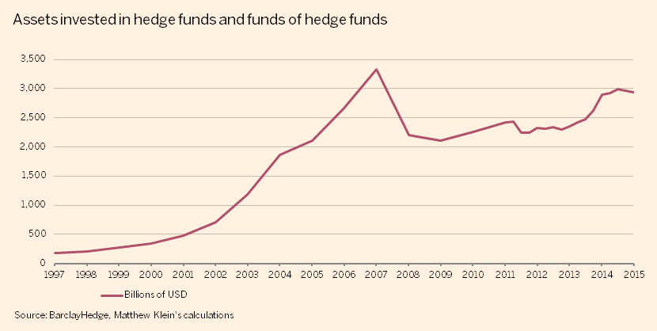
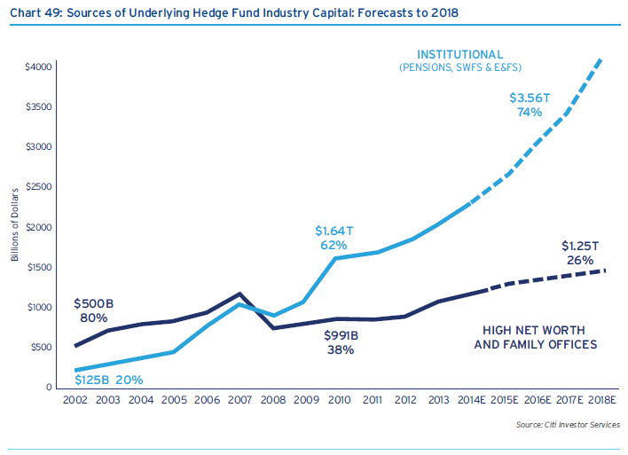

#What Purpose do Hedge Funds Serve?

Yesterday, I came across [this article](http://blog.instavest.com/the-hedge-fund-managers-who-work-for-tips) on a new hedge fund concept: browse advice given by junior hedge fund managers for free, and if you invest (and make money, presumably) based on good advice, you have the option to tip the winning manager an amount at your discretion. The company, [Instavest](https://instavest.com/) is backed by Y-Combinator, one of the largest and most successful startup accelerators in Silicon Valley. Instavest’s tagline promises the following: “Earn Profits. No Guesswork. Hassle Free.” Sign me up. Who couldn’t use some hassle and guess-work free profits, especially in the murky world of high-risk, high-opacity, super-leveraged derivates trading.

The author argues that a new tips-based hedge fund format will help combat one of the less attractive attributes of the average hedge fund: a typical fund charges a commission of 2% of the total amount of managed cash, along with a hefty 20% cut of any earnings realized on managed assets.

Now, this wouldn’t be too much of a problem if the average hedge fund was able to earn positive returns above that baseline 2% fee they charge for the privilege of playing with investor’s money. Unfortunately, the average hedge fund has **severly** underperformed the passive, “free” strategy of investing in the market (or a portfolio of safe ETF/index funds that track the overall market closely) since the financial crisis.[^1] Essentially, investors are paying hedge funds to expose their assets to unorthodox strategies that lose money relative to safe, market-tracking portfolios that any basic investor can put together, beer in hand, in 30 minutes.

And yet, hedge funds are [only gaining in popularity](http://www.nytimes.com/2015/02/27/business/hedge-fund-returns-falter-yet-money-continues-to-flow-in.html).

I met a guy over the weekend who works at a hedge fund in Cambridge. I figured if anyone could tell me what hedge funds are all about, it would be him. So I asked him the following question:

>Why do people still pay to lose money in hedge funds?

He told me (half-jokingly) that his hedge fund survives on institutional investments and that most of their clients don’t really care as long as his fund “doesn’t lose *too* much money”. So there was one part of my answer. Your average hedge-fund investor is an ultra-wealthy institutional client who needs to to reassure the board of [Private College], [Insurance Company], [Pension Fund] that a portion of the dragon’s hoarde of treasures is being looked after by some smart, old guy.

Still, that doesn’t sit perfectly well with me. I think there's a bit more to the hedge fund craze.

##Random Walk & Strong Form Efficiency

If you take any finance class anywhere in the world, you are bound to come across the **random walk (with drift)** hypothesis and the **efficient markets** hypothesis.

The **random walk with drift** hypothesis posits that the stock market moves in a stochastic (random) fashion in the short run, but that it “drifts” upwards in the long run. This means that it’s impossible to predict future values based on historical data, and that spending time and energy actively picking stocks will not earn you a return higher than the return on passive, steadily-appreciating market portfolio.

The random walk theory is a somewhat generalized version of the **efficient markets** hypothesis, which states that in a **strong form efficient** market, it is impossible to beat the market because every single piece of information relevant to the value of every single stock has already been priced in. Thus, every stock is worth exactly what it should be at all times, and an investor can never be “ahead” of the market.

The stock markets are most definitely not strong form efficient, as investors are not purely rational beings that trade on perfect information. But the markets are notoriously hard to beat for an extended period of time (see **semi-strong form** efficiency). And, theoretically, the difficulty of beating the market should only be *increasing* as the flow of information becomes quicker and broader, the volume of trades (especially algorithmic, machine-executed trades) increases, and an ever-increasing number of investors enter the market.

The only way to reconcile these hypotheses with the continued, and in recent months, increasingly feverish hunt for hedge fund **alpha** (a fancy finance term for above-market profit) is through differences in information – what many would consider “insider trading”. In an efficient market, funds that consistently outperform the market are either 1 in a million lucky (how do you choose this firm as an investor? you can’t), or they trade on information that others do not have access to.    

##Informational Asymmetry

Insider information is the only logical reason to invest in a hedge fund **during a bull market**. Pick the fund with the managers who are buddies with Janet Yellen, go golfing with fortune 500 CEOs on the weekends, and vacation in Europe with French politicians. Just hope that they aren't the 1/100 that the government decides to make an example out of, or that they can pay for a really good lawyer (which they usually can). Otherwise, as most of my professors have advised, you should just invest in a portfolio of ETFs and only pick stocks for fun with money you aren’t afraid to lose.

Some have argued the following:

>I think you raise a few good issues but I’d like to poke, lightly, at the idea that the only information advantage available to hedge funds is “insider” information. Certainly some successful firms built their track record with illegal insider trading that but that’s not the whole story.

>They have better access to research, they have better access to the analysts whose opinions help drive public understanding of the company, they have better access to management to ask clarifying questions on areas of concern. They spend every day steeped in the facts, perceptions, and research that are relevant to investing. In short, they have a massive information advantage over a casual investor or day-trader. This does not, necessarily, mean they’re trading on “insider” information.
Finally, just to clarify, insider trading is often misunderstood. A violation depends on meeting all of the following criteria:

1. The information is material,
2. The information is non-public,
3. There was a breach of duty in sharing or trading on the information.

>As an oversimplification: if Joe overhears a conversation between the CFO of a Fortune500 company and his boss talking about losing a major contract...only the first two criteria are satisfied and Joe can buy/trade without fear of prosecution.[^2]

**—dkfmn on Hackernews**

I agree that hedge fund managers have a massive information advantage over the casual investor, as this is their job. My argument is not hedge fund vs. casual investor, it’s hedge fund vs. hedge fund.
    
These guys are all equally-intelligent individuals with the same prestigious degrees and expensive equipment. There are thousands of them entering the hedge fund game every year. The only differentiating factor in this saturated market is network strength.

I’m also not arguing the legality of trading on insider information either. The laws are notoriously unclear, hard to enforce, and subsequently broken because information is harder to track than money, blood, and drugs. At the end of the day I would appeal to an ethical duty not to impoverish one’s fellow man and rend the fabric of the society that brought one up, rather than the flimsy and unenforceable definitions set forth in the legal code.

##Popularity of Hedge Funds as a Proxy for Market Sentiment

There is one other idea that I’d like to put forth: in the current market, the amount of money that is being invested in hedge funds is strongly correlated with **bearish investor sentiments**. In other words, institutional investors are becoming increasingly scared and uncertain; they are willing to pay financial wizards to lose money relative to the market because they *are scared of an imminent crash *and they believe that a hedge fund will be able to predict and outmaneuver other active managers if this happens, or at least have some kind of stopgap solution in place in the event of a financial meltdown. After all, this is what “hedging” refers to – protecting a portfolio against sharp/sudden losses.

Post-crisis, institutional asset managers want to be able to turn to the board of their respective institutions and say, ‘Well you can’t blame me, I put our money in a **bona fide hedge fund**! Do you have any idea how expensive that was? Those guys were supposed to be geniuses. I did all I could. Definitely not my fault. In fact, I should probably get a bonus.’ Hedge funds are a mechanism by which they can wash their hands of all guilt in the event of losses sustained during a financial downturn.

Let’s look at an example: In 2008, hedge funds returned -18.3%, compared to the S&P’s abysmal return of -37% due to the financial crisis.[^3] That was the last time hedge funds, on average, have outperformed the market – 7 years ago. 

##Conclusion

In conclusion: there are only two logical reasons for the continued popularity and growth of the amount of assets under management by hedge funds:

1. Investors believe that the hedge funds that they have chosen are managed by individuals who have access to insider information; this will allow the fund to generate a return well-above the average hedge fund, which has underperformed passive management for the past 7 years.
2. Institutional investors want to put money into an investment vehicle that has the reputation for being super-actively managed by financial gurus because they intuit a looming financial precipice behind the nebulous activity of the strange and “unique” stock market that is propped up by an increasingly tense global economy.

##Footnotes

[^1]: According to the Instavest article: ‘last year the average hedge fund made 3.3%; S&P 500 index gained 11.4%.’ Similar story over the past 7 years.

[^2]: See [this article](http://www.dallasnews.com/business/headlines/20131013-cuban-case-has-parallels-to-switzers-30-years-ago.ece) for the hilarious (and real) version of the Joe story, in which a football coach meets with some CEO at a stadium, then decides to lie down on the bleachers behind him to get a tan, all the while nonchalantly listening as the CEO tells his wife of an impending company catastrophe. The coach and his buddies short the stock the next day and make a killing, but it's all good and legal because there was no breach of duty! Funny what a tan can do for a man.

[^3]: See this [market folly](http://www.marketfolly.com/2009/01/2008-hedge-fund-performance-numbers.html) post.