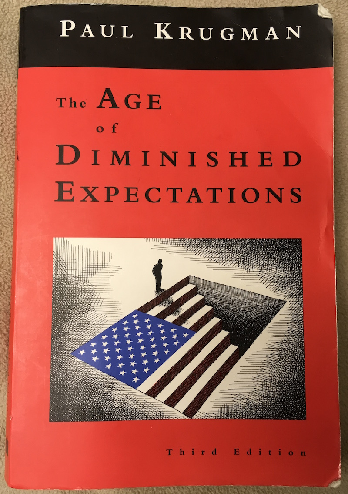
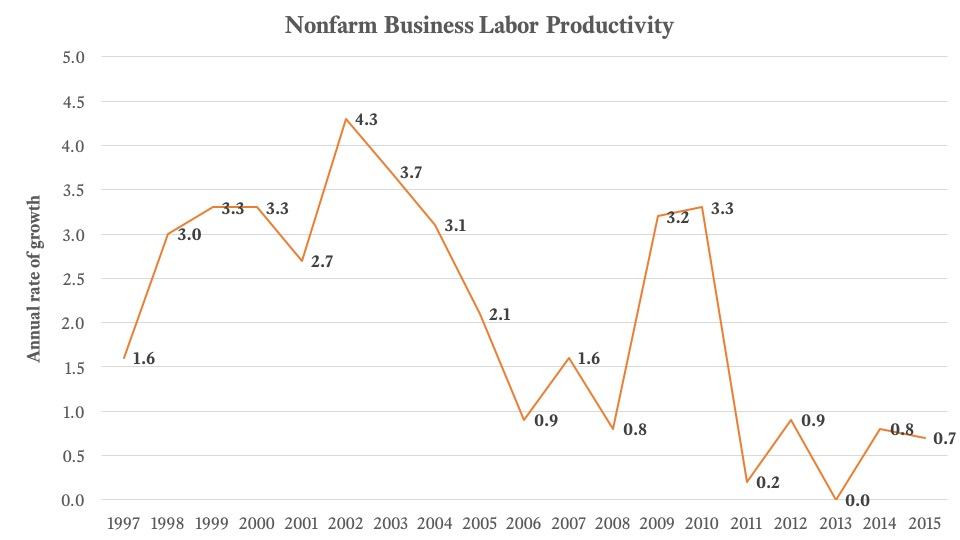

#Review of Paul Krugman’s The Age of Diminished Expectations



##Background

Paul Krugman wrote *The Age of Diminished Expectations* in 1990 as the first book in the Washington Post’s *Briefing Books* series. Krugman was 37 and employed as an economics professor at MIT when he wrote the book. He would go on to have a successful academic and literary career, winning the Nobel Prize in Economics Sciences in 2008 for his work on New Trade Theory. He recently retired from teaching at Princeton, and continues to write a widely-read column in the New York Times.

This book was his first attempt to marry academic, “Greek-letter” economics with casual “airport” economics. He states that he aimed to create “a short book about the U.S. economy that would be accessible to a nonprofessional public while maintaining intellectual quality.” He compares the book to an automotive owner’s manual which describes how the parts of the economy fit together and work as whole without pushing for particular answers to the identified problems. He is able to maintain a fairly neutral tone throughout the book.

I read the Third Edition, released in 1997, because I had read some of Krugman’s “Conscience of a Liberal” columns in the New York Times and wanted to get an overview of his earlier thinking that might be unavailable or obscured in academic format.

##Key Driver 1 - Productivity

Krugman starts by providing a definition of **standard of living**: “For the economy, the important things — the things that affect the standard of living of large numbers of people — are productivity, income distribution, and unemployment. If these things are satisfactory, not much else can go wrong, while if they are not, nothing can go right”. These are Krugman’s First-Order Variables (FOV), from which second-order issues, such as inflation and international competitiveness, derive.

Krugman argues that, from the viewpoint of the mid-to-late 1990s, we are in trouble WRT the US standard of living as we are seeing a slowdown in productivity, as well as an increase in income inequality relative to the post WWII era. A return to cheap energy prices (relative to the 1970s oil crisis) did not boost productivity. Reagan’s deregulations, while not “an abject failure,” did not produce meaningful gains in productivity. In 1993 the Clinton administration announced that it would provide $4B in technological subsidies – Krugman sees this as “pocket change in a $6T economy”.

So what can we do to fix productivity growth if energy prices, deregulation, and (meager) technological subsidies aren’t working? Krugman says the answer is simple: “suffer”. Consume less now, invest more resources in capital for workers and education for children. At the policy level, this translates into a few low-risk political solutions: the federal government can encourage higher educational standards and support industry research consortia. But ultimately he concludes that fixing productivity, the most important factor that almost singlehandedly determines standard of living, is “not a policy issue, because we are not going to do anything about it.” Bummer!

##Key Driver 2 - Income Distribution

Krugman points to income distribution as his second FOV. He argues that (even in 1997) “the rich have become a great deal richer, while the poor have become significantly poorer”. The widening is indeed dramatic and a sharp departure from the post WWII years, as evidenced by Figure 8 from the book.



Krugman shies away from the politically-charged finger pointing that surrounds the growth of the underclass, saying that welfare-corrupted incentives (conservatives) and Reagan’s social security cuts (liberals) could both provide plausible explanations, but that these arguments belong in the realm of sociology – a realm that 2016 Krugman would enter with gusto. Krugman does make a concrete argument that the growth in income for the rich is almost directly attributable to the growth of the finance industry, but he is unable (or unwilling) to provide convincing data or a concrete thesis on the true roots of income inequality, which has only intensified in the past 20 years.



Taken from June 2016 Congressional Budget Office report, [*The Distribution of Household Income and Federal Taxes, 2013*](https://www.cbo.gov/sites/default/files/114th-congress-2015-2016/reports/51361-HouseholdIncomeFedTaxes_OneCol.pdf).

Krugman states that the problem with poverty, as an issue, “is that it has exhausted the patience of the general public”. Perhaps this was true in 1997, when the middle class and the baby boomer generation were not yet feeling the slow burn of poverty spreading quietly within its ranks, but our current election cycle has unearthed deep, and growing pockets of poverty-frustration anew – see the subset of Bernie Sanders supporters who will vote for Donald Trump over “corrupt” Hillary Clinton, sacrificing religious and racial tolerance in order to defeat the perceived greater evil of the global financial interests (and status quo) that back Hillary. Obama went so far as to call income inequality “the defining challenge of our time.”

Krugman concludes that, like productivity, income distribution “is a policy issue with little prospect for serious policy action. The growing gap between rich and poor is arguably the central fact about economic life in America. But no policy changes now under discussion seem likely to do much to narrow this gap.” Very prescient.

##Employment, Other Odds & Ends

The third FOV – employment – is out of touch with today’s reality. I believe Krugman should not have included employment as an FOV, as it is really just a measurement of the labor side of productivity, and an incomplete/dangerous measure when examined alone as it obfuscates labor force participation and the different shades of employment status. Productivity (how effectively can we make stuff) and income distribution (how effectively can we distribute stuff) are really the two planks that deserve FOV status, and from which the rest of the book’s discussions stem. To me employment is a caused, not a causal variable, and can be derived from changes in FOV productivity and income distribution.

The majority of the book centers around dissections of the “chronic aches and pains” of the trade deficit, inflation, as well as the policy problems of healthcare, the budget deficit, social security, the federal reserve, protectionism, the value of the dollar, and Japan. While it was fascinating to read about another period when the public was quick to blame many of its own problems on a mysterious Asian powerhouse, much of these discussions end with similar conclusions: there is a lot of noise about largely inconsequential policies, relative to the true drivers of prosperity – productivity and income distribution – which are in poor shape. They provide good historical insight and context, but I will not discuss them in detail.

Additionally, it is important to note that the economy performed relatively well from the 1997-2010 time period (see figure below), and that productivity surged shortly after Krugman predicted that it would stagnate. Many would attribute the success of the 1997-2010 timeframe to technological advances: the internet and the cellphone have transformed the way that we conduct business. So Krugman’s prediction of simple stagnation did not come true, although I would argue that when viewed on a longer time scale, they have come back to haunt us in the not-quite-recession-but-strange-and-stagnating economic conditions of the past 7 years. So he was right that in the long run, “we live in an age of diminished expectations, in which the voting public is generally willing to settle for policy drift; but there is an age to come when even that option will no longer be available”. Recent productivity numbers certainly indicate this to be true.


Data from the [BLS](http://www.bls.gov/home.htm).

##Takeaways

The largest takeaway from this book is that, for political reasons, actual policy items are usually twice-removed from the larger macroeconomic drivers that will determine the US’s standard of living in the long run. The contrapositive is that political crisis creates opportunity. Perhaps the 2016 elections will result in just such a political crisis, but I doubt it. Like 1997 Krugman, I think we will see more stagnation as we have not yet reached the tipping point of public (and private) discontent that would be needed to enact serious political reform. As Krugman puts it:

> Any serious effort to increase productivity growth, or to reverse the sharp increase in income inequality, or to restructure our labor markets to get closer to true full employment, would take a degree of boldness that is rare in economic policy. Attempts to change the economic system in a fundamental way, like Franklin Roosevelt’s (or Ronald Reagan’s), occur only in the face of economic crisis.

##Omission? Technological Drivers of Productivity

Krugman notes, somewhat paradoxically, that productivity growth slowed in the 1970s and 1980s even though the federal government kept the level of investment in capital and education constant, undermining his previous suggestions to suffer, reduce consumption, and plow investment into capital and education. He states that we might “simply get lucky” without any positive action from our leadership.

If we look at a simple neoclassical production function, Y=zf(L,K), we see that calls for increased amounts of investment addresses the Capital (K) variable, but that Krugman doesn’t suggest technological-focused policies to increase the Solow Residual, or Total Factor Productivity (z) – fancy names for increases in technological and/or human knowledge potential that boost overall productivity.

Why doesn’t Krugman consider the technological drivers of productivity in his forecasts? He states that some economists and “productivity optimists” believe that productivity statistics cannot accurately capture the fundamental advances in technology and its impact on the economy. To this he responds:

> The Internet is a lot of fun, and very useful to some people; but think aback to the advances that drove the sustained productivity boom from the 1940s to the 1970s. During the postwar generation car ownership, home refrigerators, supermarkets, passenger air travel (the Boeing 747 was introduced in 1969), and direct-dial long-distance calling created a true revolution in the way people lived and worked. Have any of the recent achievements, however impressive, made a comparable difference?

He tacitly acknowledges the importance of technological inputs to productivity growth, but he does not devote any more time or attention to them. Perhaps it is this shortcoming that led him to posit in 1998 that “by 2005 or so, it will become clear that the Internet’s impact on the economy has been no greater than the fax machine’s”. While I consider myself a technology optimist, it is hard to see what the next big TFP-boosting breakthrough might be: virtual reality? Self-driving cars? CRISPR gene selection and revision? I guess that’s the point though – nobody really knows until it happens and takes the world by storm.

##Conclusion

Overall The Age of Diminished Expectations an insightful and lucid perspective of the economy and its troubles from 20 years ago, with the main issues shedding light on some of today’s most contentious issues. Worth the read.
