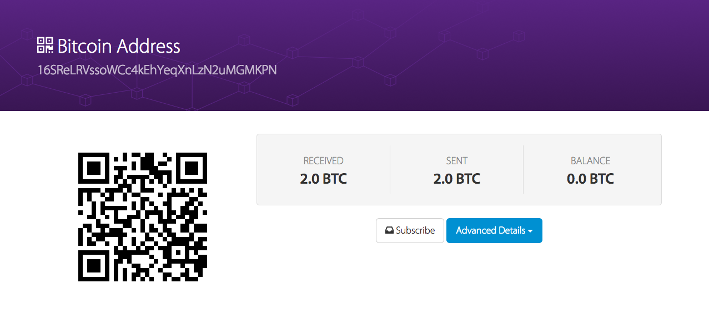
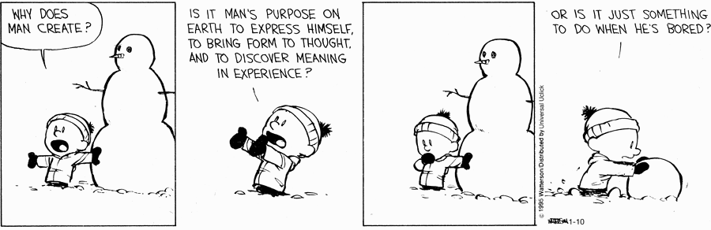

#Bitcoin 3 years on.

The last time I wrote or thought about Bitcoin (BTC) seriously was in April 2015 [for my college thesis](http://roymurdock.com/thesis/murdockthesis-final-2.pdf). It was trading at ~$600 then. It’s now up around $6,500 per BTC, and the huge increase in price has brought about an equally large amount of attention and work to the crypto currency ecosystem.

As part of my initial research, I wanted to see how easy it would be to purchase, hold, and possibly use BTC to make a few purchases. So on February 19th 2014 I purchased 2 BTC.

Then, 5 days later, the infamous Mt. Gox announced that it had been “hacked” for an estimated loss of 450m at the time. During the ensuing chaos, no one quite knew what to do with their exchange-held currencies.

I remember seeing videos of one pissed-off Mt. Gox user flying to Japan and standing outside of the Mt. Gox office HQ, holding a protest sign and getting in CEO Mark Karepelès' face any time he entered or exited the building.

<iframe width="560" height="315" src="https://www.youtube.com/embed/ob9Ak1t09Ao?rel=0&amp;start=32" frameborder="0" allowfullscreen></iframe>

That pissed off dude, and the whole Mt. Gox fiasco helped me realize that Bitcoin was something real, that actually caused actions and reactions in the real world. Something with physical arms and legs, that could show up on your doorstep and get in your face, demanding action. Yeah, we all read the accounts of hitmen and drug dealing, but let’s be honest – were the real criminals using some complicated and obscure cryptocurrency, or were they using cash?

##Cashed Out

Back to my 2 BTC sitting on Coinbase’s servers. I took the scandal as an opportunity to test out another feature of Bitcoin – moving and storing Bitcoin in a personal, “paper” wallet. 

I created a new key pair and traded my 2BTC into my new wallet, and promptly had the 2 BTC stolen on March 11th 2014, just over a month later. I wouldn’t realize this until well over 3 years later, when I went to check the wallet balance.

I forget what program I used to generate my “paper” wallet – but I stored the private key in a word doc on an external hard drive.

I’m guessing that the seed I used to generate my private key was way too weak (just characters and numbers instead of a true source of entropy) and that my seed had been checked, allowing someone to derive the corresponding private key. Or the generator I used relied on a pseudo-random number generator. I doubt it was a virus that somehow read the contents of the word doc, but I guess that’s also a possibility.

So I’ve been cashed out of the Bitcoin game for 3 months consciously, and 3 years de facto. In that time I’ve kept an eye on blockchain projects such as the [HyperLedger from the Linux Foundation](https://www.hyperledger.org/) and a smattering of IoT-related blockchain projects. My main source of news on ICOs and the like has been Matt Levine’s excellent [Money Stuff](https://www.bloomberg.com/view/topics/money-stuff) newsletter, and the various briefings I’ve had with companies such as IBM and SAP that are working on applying blockchain to supply chain and logistics problems.

##Losing the Bitcoin/Blockchain Zest

So now to the point of this post – how do I feel about Bitcoin/blockchain 3 years on? I’ve lost my zest.

<iframe width="560" height="315" src="https://www.youtube.com/embed/l644fAxGzlw?rel=0" frameborder="0" allowfullscreen></iframe>

This new ICO *almost* rekindled my zest.

Initially I found the blockchain cool because it promised to shake things up a little bit. At its core, the blockchain is boring as hell – it’s a database. But…it’s also a database that introduces some fun game theory/economics interactions because, unlike an excel spreadsheet or an RDBMS, it requires teamwork. Well, maybe not *teamwork*…more like Mutually Assured Destruction (MAD). it’s an interesting, messy, and potentially revolutionary way to keep a shared ledger of activity.

With this new, messy database technology came the potential for any individual or group to set up and run a payments network. In theory this had always been possible, but blockchain was the first technology that beautifully solved the problem of double spending. In the Bitcoin blockchain implementation, you don’t need to trust that the database maintainer is honest because there is no one central record keeper – all of the millions of record keepers are mining, verifying transactions, and keeping one another honest. Pooling up to consolidate resources, sure, but not to the point where a pool could [control 51% of the network](http://econinfosec.org/archive/weis2013/papers/KrollDaveyFeltenWEIS2013.pdf) – because that would make Bitcoin - the asset they are working to generate - worthless.

So what have people done with Bitcoin and the underlying blockchain tech in the intervening 3 years? The coolest project I’ve seen is [Open Bazaar](https://openbazaar.org/) – a P2P online marketplace run on Bitcoin that eliminates the fees/middlemen of Paypal and Amazon (which means probably needs a headache-inducing arbitration scheme to settle trade disputes). There have been a few proof-of-concepts, such as [IBM and Samsung ADEPT](http://rethinkresearch.biz/articles/ibm-samsung-unveil-adept-blockchain-proof-concept-iot-security/) project that allowed a smart washing machines to automatically order and pay for washing detergent when it ran out. 

Then there has been ongoing ICO circus, the hundreds of projects that try to sell their use of blockchain when a simple database would suffice (and in many cases simplify the project), the DAO fiasco, the numerous attempts to fork popular coins, the China currency controls crackdown, and the astronomical growth of the energy costs required to maintain the Bitcoin network. Combative, proof of work systems require energy costs that scale up with the size of the network. Bitcoin farms cast off in the form of heat that small operations can heat entire homes. These miners in Siberia [heat a small cabin](https://www.curbed.com/2017/11/9/16619032/bitcoin-mining-heat-homes-siberia-russia) with the heat cast off by their mining rigs.[^1]

##Satoshi’s Vision

There’s something undeniably sweet about Satoshi Nakamoto. He (or she or they) holds 1M in Bitcoin ($6.5B), and yet you know they're way too principled to cash out, or interfere in any way with the chaotic technology he unleashed on the financial world. They are a true mad scientist, and the polar opposite of today’s white paper ICO promoter. Their withdrawal from the project, and more importantly, the source code that pins the currency cap at 21 million, is the stuff of legends.

I imagine Satoshi waking up, sipping some green tea, checking the latest cryptocurrency news, and chuckling. His idea has been validated in some ways and corrupted in others. Blockchain research is energetic and full of life, but chain-coins lack the stability and UX/UI to be used by ordinary people for regular transactions. Currently it's little more than a source of volatility for speculators to trade on, but it could grow into something more tomorrow.

I have no

[^1]: I’ve heard Ethereum is working around this by implementing proof of stake instead of proof of work, but I have a hard time conceptualizing how a decentralized blockchain could function without proof of work.