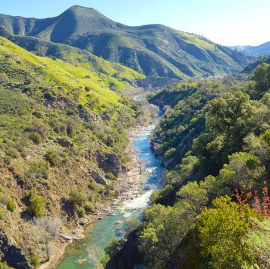
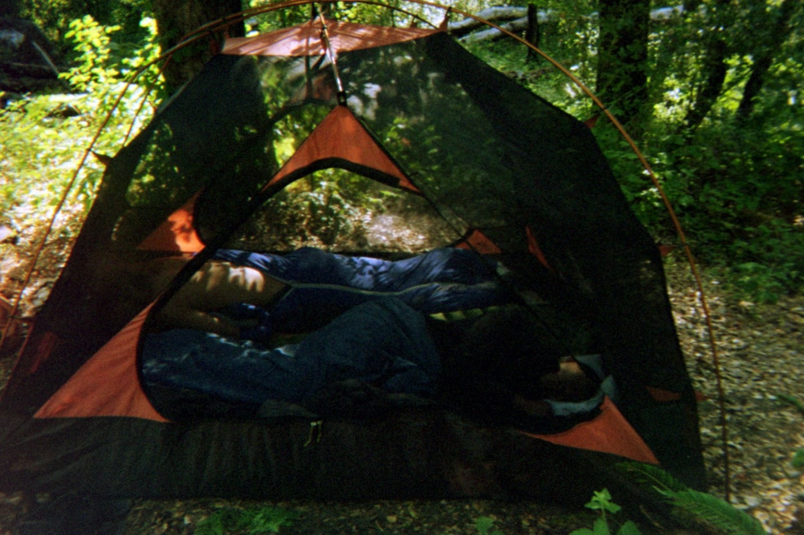
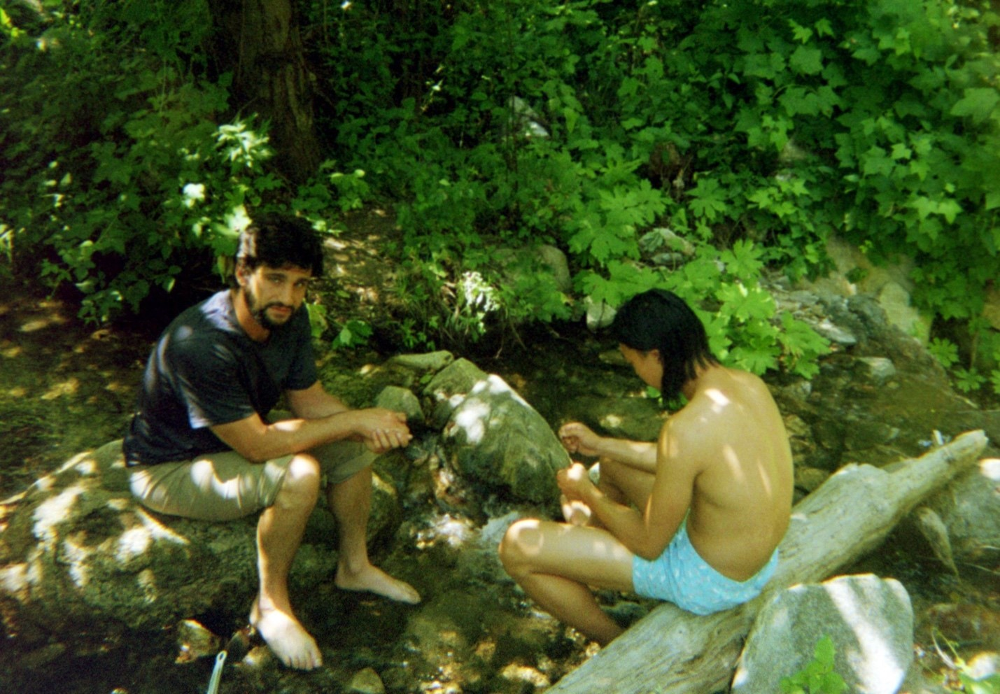
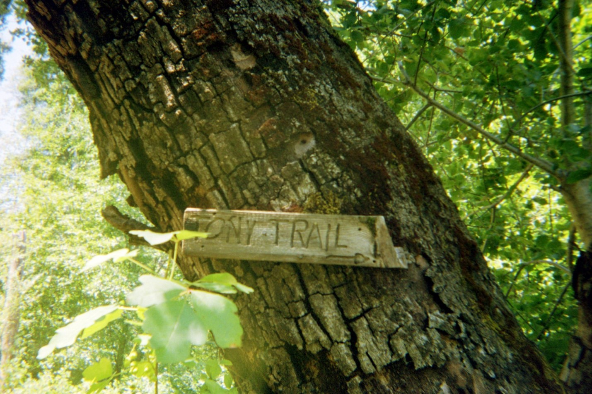
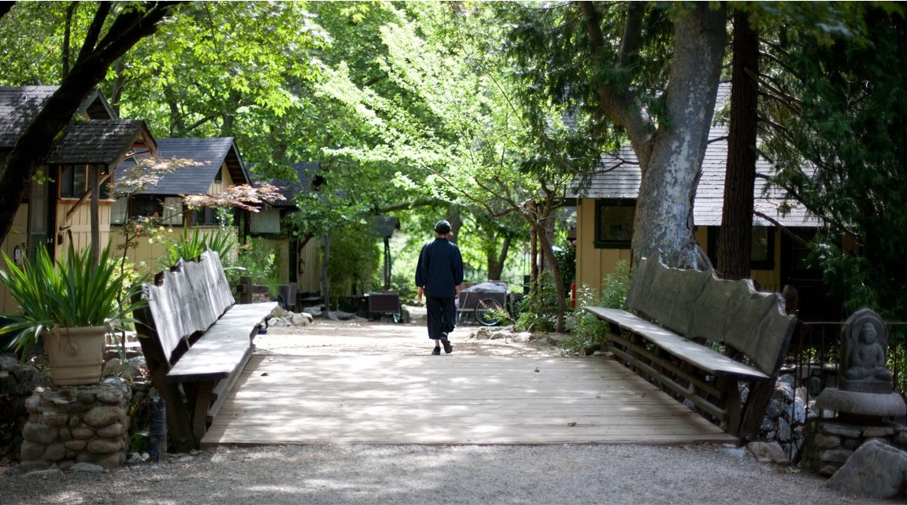
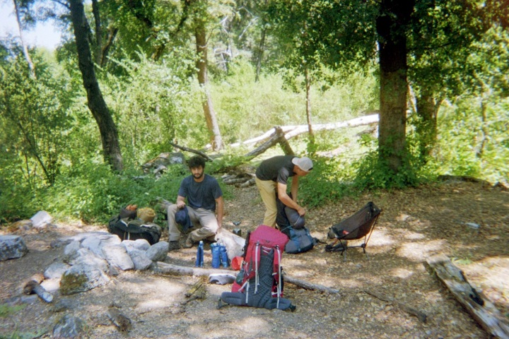
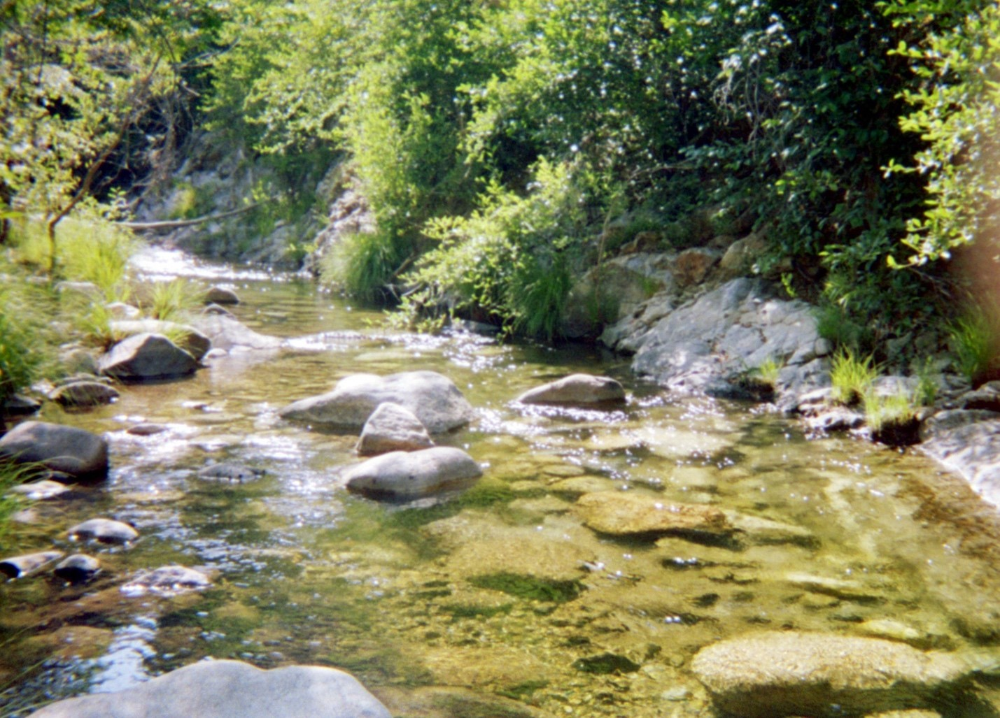

<!DOCTYPE html>
<html class="no-js" lang="en">

<head>
<meta charset="utf-8">
<meta name="viewport" content="width=device-width">
<meta name="Description" content="Personal blog of Roy Murdock, featuring essays and photographs. Topics are macroeconomics, finance, and technology.">
<body>

<?php include ($_SERVER["DOCUMENT_ROOT"]."/includes/header.php"); ?>

<!-- Content -->

# Ventana Wilderness, Big Sur, July 2019

## Marble Peak Trail

Route Overview: 4 days, 3 nights, 20 miles, 6000ft gain

The team consisted of Roy Murdock, Jay Lee, and Evan Werner. Three humble voyageurs wishing to explore the beauty of Northern California. And what better place to pick than the rugged mountains, shaded valleys, ancient burned out oak forests, and emerald green creeks and grottos of Big Sur.

The three of us have varied skills that we used on the trip. Roy is a 26-year old hiking and nature aficionado and photographer with backpacking experience in the Swiss Alps, Maine, Georgia (country), and canoeing experience in the beautifully remote Boundary Waters between Minnesota and Canada. Jay is a 25-year old outdoorsman and technologist.  He is a well-traveled voyageur, rock climber, surfer, and scuba diver hailing from LA and currently residing in San Francisco with advanced navigational skills and a keen spirit for adventure. Evan is a 26-year old New York native, master scuba diver, spear fisherman, and avid surfer. He has traveled to Mexico and Costa Rica (and soon Bali) to catch remote surf breaks, and resides in LA where he is finishing up his first full-length novel.    Clearly ocean water courses through the veins of these three companions, but this trip will be a different sort of test than the whitecaps and riptides they are used to.

Jay and Roy designed the trip’s route, with Jay designated Chief Navigation Officer (CNO).  As Chief Commissioning Officer (CCO) Roy prepared the menu and gear list .  Evan brought boundless energy, constant vigilance, and a willingness to sacrifice life and limb as executive Bear Brawling Officer (BBO).  

At the outset, we had 3 major risk factors. I will outline them here. First, rattlesnakes. They love to sun themselves in the relative open and sunny camp sites, and also have a knack for being behind rocks or in crevices where unwitting travelers tread.  A rattlesnake bite is the quickest way to end a trip and will set a deadly timer in motion while a healthy voyageur must run back miles along the trail to civilization to get help (usually a helicopter lift out of the wilderness to a poison control center or hospital).  Second, Poison oak. The Ventana Wilderness is full, and I mean FULL of poison oak. Especially our route next to a stream – poison oak thrives near water. Not too dangerous in small quantities, but fall into a poison oak bush and you’ll find yourself in the hospital pretty quick.  Third bugs. Both mosquitoues and ticks. Mosquitoes, you know about, and there are plenty about in July by the water. 100 DEET is non-negotiable for mosquitoes. Ticks are trickier. Although on the West coast its rare for them to carry lymes disease, you don’t want to pick up any of these little suckers on the trail. Daily tick checks are a must.

Bears are rarely seen in the Ventana Wilderness, so although we remained vigilant, bear barrels/mace were not essential. Flies, though at first annoying, we came to regard as friends and companions – why fight what you cannot control? 

With this in mind, the voyage begins.

## Day 1 – LA/SF to Arroyo Seco, Hike to Tony Trail Primitive Camp

Day 1 started at 6am in LA for me and Evan. I loaded the trusty Dodge Caravan minivan the night before, and not hungry for breakfast, prepared a cold steak sandwich in tin foil and hit the road. The Dodge Caravan has a truly ingenious seat design, allowing both the middle and back seats to fold down to create a full flatbed’s worth of space for storage. An upgrade from the Honda Odyssey to be sure. I swung by Studio City on the 101 to Pick up Evan, then we were off Northbound cruising on the 5. Traffic was light at that time in the morning and I believe more people were flying between SF/LA to celebrate July 4th than were driving. Either way we made good time at 80MPH and stopping once to get coffee and a MCD’s breakfast sandwich before our rendezvous with Jay at 1PM PT at the trailhead.

When most people think of Big Sur, they think huge redwood trees and gorgeous deadly cliffs overlooking ocean sprays on the PCH, or coastal Route 1 that connect SF to LA. This trip redefined Big Sur for me, at least. We came at the region from the East, from the great bountiful valley and farmlands south of Salinas and West of Fresno, not from the coast. Our drive took us past rolling golden brown hills dotted with oak sycamore and birch, bountiful vineyards, deserted railroad tracks, and huge oilfields with small derricks steadily pumping under the hot summer sun. The last few miles into the developed campground we drove next to the river that fed many of the surrounding farms, and that would become our lifeblood for the next four days – Arroyo Seco (“Dry Stream”), a tributary of the main 175-mile Salinas River that feeds much of the farmland of central California.

We pulled into the campground and paid $40 for 4 days parking. Permits aren’t required in the Ventana Wilderness aside from a quick online fire safety permit. A cost-effective way to backpack for sure, compared to the $900 (!!) we paid in fees to access the Canadian Boundary waters.  The park rangers regaled us with a fun story. A week earlier, a group of backpackers were planning to exit the wilderness at Arroyo Seco. Well, they miscalculated their route and were somehow trapped in by surging waters. We had record snowfalls this winter in California which melted and fed into a waterfall that was now blocking their path. What to do? You know you’re running short on options when you put your heads together and decide…to send a literal message in a bottle downstream. A rivergoer found the bottle with the message “HELP, TRAPPED BEHIND WATERFALL” written on it and dutifuly delivered it to the rangers. The rangers ended up sending a helicopter to airlift the stranded backpackers. One hell of a campfire story for that group to tell on future hikes, far away from surging waterfalls!

Water warnings fresh in our minds, we parked and waited for Jay. He pulled up 5 minutes after us, Chipotle Burrito in hand, a last sign of dietary civilization.   We made quick work of stripping our bags empty and laying out gear. After distributing gear (tent, cooking equipment, clothes, food, first aid/tools, water) our 60L packs were chock full and weighed ~80lbs. Even with the densest caloric food available and little/no water weight, it amazes me how heavy the calories we burn as fuel can be.

After a bit of futzing with finding the trail head, we set off around 2pm with the sun beating down, looking at a 7 mile hike ahead of us. The first 3 miles our spirits soared as we soaked in a view of Seco Arroyo river below us.  Hawks soared lazily above as we glanced over the chaparral landscape – gray and brown -brush-covered, sand-colored hillsides rose at steep angles above the rocky, scrub covered banks along the aquamarine creek, standing about 8 feet wide and 2-3 feet deep on average – more of a creek and wash than a river, to be sure. It’s tough to imagine where a group could get trapped behind a waterfall on Seco Arroyo! Blue bellied lizards jumped off the path nervously at the sound of our boots crunching gravel, and we passed a few day hikers climbing down to the creek to enjoy a sunny July 4th in the cold water and tame rapids.

After 3 miles of following fairly even terrain on the old Indian Fire Road, the scenery as described before, we found the cutoff into backcountry trail territory. Taking the cutoff led us to a beautiful horse bridge overlooking a pristine, emerald green gem of a pool.  I fought the urge to strip off my pack and jump in immediately – we had miles to put behind us and a campsite to set up. We made mental notes to come back to this horse bridge and enjoy what we dubbed Oasis Camp. 

We crossed the bridge and set out on the 2nd leg of the hike. Now our packs were beginning to weigh heavily on us. Evan had the heaviest pack, which included the tent. He also had a misconfigured buckle digging into his back. When backpacking, you want the pack to sit on your hips cinched as tightly as possible to prevent movement. When your pack wobbles, you expend energy fighting the lateral or backwards wobbles and stabilizing instead of putting all your calories into pushing forward and up.   Evan was fighting all wobbles with his pack, and fell silent after a mile on the now narrower and inclined trail.  Later he would describe seeing white on the inclines as he strained to keep the buckle out of his back while lugging 80lbs up the side of a mountain.  The beauty of backpacking! You earn your meals every night to be sure.

3 miles in, morale was fading fast. The sun was beginning to set and we were past ready to put our packs down. Water had run out and we didn’t want to break pace to filter on the trail. Resting for more than a minute was out of the question due to swarms of mosquitoes with heat seeking missile like abilities. The creek crossings just kept coming, maybe 6 or 7 in total.

Finally I made the call to scout ahead, letting Jay and Evan rest up. I forged 100 yards up the path and found a (questionable) clearing. It obviously hadn’t been used as a campsite in a LONG time, but would do in emergency. Burrs-filled plants and logs everywhere but we could stomp those down and clear a place to put our tent. Lots of bugs. I left my pack and ran a further 10 minutes up the path, feeling free as a bird with no weight. According to Jay’s calculations we were supposed to hit a great little campsite at mile 4. After hitting another creek crossing at what I mentally calculated to be mile 4 I turend around, defeated.

I returned to the “Disaster Camp” where I left my pack to find Jay and Evan waiting. Jay was certain the good campground was just up the road. Having just chcked, I was certain it wasn’t. Evan and I made our way down to the creek to rehydrate while Jay, surveying the dismal “Disaster Camp” decided to forge on ahead. He left his pack and scouted ahead while we rehydrated. Just as I was deciding where we’d need to clear brush to camp, good news. Jay returns with a picture of a beautiful little spot 300 feet ahead of where I had stopped and turned around. Well, back in the saddle. We gathered our gear and the last of our remaining strength and hit the trail, forging ahead against mosquitoes and the dying sunlight. We blazed past the last creek crossing and hit “Tony Trail” primitive camp just in time.

The packs came off immediately and we started to figure out our roles. Roy on food, Jay on camp fire, Evan on tent and water. Dehyrdated Mashed potatoes, salami, and onion/red pepper/garlic fajitas were enjoyed with a bit of avocado and tortilla along with some red wine to wash it down.  Oh did I forget to mention – we brought 6liters of wine – 3 liters red, 3 liters white, totaling 15lbs of liquid weight! Priorities…

Cigar (bugs hate the smoke) and wine going around the campfire, we felt good.  Beautiful night with a new moon giving us nearly full visibility of the stars. Evan was the first to turn in after his long battle with the pack.  Jay and I stayed up and finished the wine – big mistake. We probably had a bottle and a half each. After much commotion and packing/repacking/unpacking of gear, we finally made it into the tent to sleep.

## Day 2 – Tony Trail Camp, Tassajara Zen Mountain Center

The voyageurs slept in on day 2 tired and slightly hung over from the first day of adventure. I was the first out of bed at around 9am.  The rushing waterfall in the nearby stream called my name and I obliged with a beautiful rinse in the cold morning water.  Evan and Jay began to stir in the camp as the merciless California sun went to work.  Feeling clean the first order of operation was breakfast. I had packed 18 large white eggs (need to buy hard shell next time, we lost 3 to mishandling on the first day), the secret to a hearty trail breakfast. A bit of hot sauce, cheddar, and a flour tortilla and you have a tasty protein/carb snack to kick start to day. Don’t forget the coffee – Starbucks VIA instant is surprisingly good, plus no mess and no  extra trash or stress of filters etc. Thanks to John Bostick for all of the food knowledge – I borrowed heavily from his Boundary Waters menu!

After food and coffee we were still not yet recovered. Our original plan – 4 miles further with packs, then 11 miles round trip to the top of Marble Peak and back down – was out of the question.  Instead, we decided to enjoy ourselves and take a shorter day hike in the afternoon. We took our time cleaning up camp, Jay took a short nap, then we spent a luxurious 2 hours in “The Grotto” – our own private section of the river complete with shady nooks, waterfalls, sunny logs, and air cooled by the flowing stream.

We broke for lunch, then went back to the Grotto to cool off. It must
have been 90 in the direct sunlight, a nice 75 in the shade of the
Grotto-chilled air. Jay found a trailhead and went off to explore while Evan
and I lounged until around 4pm. With 4 hours of daylight left and finally
feeling strong, we agreed to take an adventure. One small day pack, 6 liters of
water, 3 power bars, and we were ready. The destination: Tassajara Hot Springs
and Zen Meditation Retreat. Estimated at 6 miles round trip. Rule of thumb we
were using 2mi/hr as a standard pace, so we figured no sweat. 3 hours round
trip. After a bit of a false start, we were off up Tony’s Trail, which promised
to bring us over the ridge of the canyon we were camped in, and down into the
next valley North of us. Prudently, Jay asked if anyone had brought cash.
Nobody had. My impression was of a rugged, remote hot springs with maybe a few
simple houses nearby for the monks. We brought our swimsuits, provisions, and
nothing else.

Tony Trail was a narrow, sandy, switchback heaven that hit us around
every corner with the powerful dry-musk of the ubiquitous silver/purple sage.
We drank in the sights of the high chaparral away from the water – big honey-colored
Yuccas in bloom, red-brown manzanitas with smooth peeling bark, hardy plants
and shrubs made to retain moisture and survive(frequent) wildfires.

We crested the canyon at around 6:30pm. Not bad, a bit behind schedule, but our 6 mile estimate was on the low side. Passing through a saddle we were treated to an incredible view of the next valley over.  We began our steep descent and soon picked out solar panels on the opposite hillside, so we knew we were close. Now I was thinking…solar panels, must be a bigger operation than I wagered.  Jay had bad blisters forming on his heels and toes, but decided to push on to see the hot springs. We flew down the other side of the canyon, arriving at the first signs of buildings around 7pm.

Immediately it became clear that we were getting way more than w bargained for.  We came upon a procession of the cleanest people with the most serene expressions who were slowly and quietly walking among beautiful Japanese-style wooden lodges and buildings.  The hot springs were enclosed by a full-on Japanese bathhouse, divided by sex and offering towels and shower service!  With our sweat-stained garb, caked-on layers of Deet/suncscreen/dirt/dead insects, large backpack in tow, walking sticks, two day scruff, and hungry eyes it was clear that we had miscalculated.  Zen individuals bowed to one another as they passed in silence, on the way to bathe or have dinner. We made our way to the front desk and ask a somewhat befuddled clerk if we could bathe. $35 day passes and a rapidly approaching sunset) ruled that out. But we made mental notes to come back,  with girlfriends or family in tow.

Turns out there is a rural road that connects to the Tassajara Zen center, allowing non-hikers easy access. The buddhist monks open the center for half a year as a retreat. The other half they use it for meditation and rituals and its closed to the public.  Many buildings were rebuilt recently following the 2015 Tassajara wildfire. It’s a truly serene little community that I’d like to revisit. There are cabins to rent, but I’d prefer to pitch a tent in their campsite 3 minutes outside of the center – cheaper and more fun. Plus the large campsite was empty when we walked through.

We walked around and got our fill of the place. It was a surreal experience stepping out of fight-or-flight wilderness mode into serenity.  And we loved it. Savages roaming in “civilization”.  On our way out a few nice older ladies invited us to dinner to swap stories and learn more about the center – next time. We had a long hike back, and darkness was approaching. We turned on the jets and booked it back over Tony’s trail, arriving back at our campsite just as dusk swallowed up the trail. 10 more minutes and we would have been hiking in pitch black.

Dinner was a quick affair due to how late (9pm) we got back. By day 2 our roles had become automatic and barely a word needed to be spoken on the division of labor.  I boiled some water for freeze dried food packets and mashed potatoes while Jay stoked the fire and Evan filled waters and rearranged gear.  Originally I had wanted to avoid freeze dried food – it’s not great. But now I know to NEVER bring it again. Or at least this brand. Because it was truly disappointing, half-cooked with bits of crunch and pockets of sour ??. The mashed potatoes and another pack of salami helped wash it down, but wow, just wow. We drank a bit of white wine but it wasn’t as good as the red. After a quick washup we were ready to sleep, with 8 miles behind us on the day, and plans for 4 more the next day, packs on.

## Day 3 – Tony Trail Camp back to Oasis Camp

Morning came and we rose around 9am again, feeling rested and refreshed from a day of hiking sans-packs, albeit a little sad from dinner the night before. Eggs and cheese tortillas again for breakfast, with a coffee to get the juices flowing. We loved Tony Trail camp and our grotto so much that we decided to just soak it in and enjoy, saving our trek for after lunch. Plus we wanted to stay out of the direct noon heat, so after another leisurely morning in the grotto, we ate smoked fish and cheddar tacos and broke down camp. With 2 days of food + wine gone our packs were feeling considerably lighter, and our spirits were high.

We layered our trust DEET sunscreen armor, donned our hats and
sunglasses, checked water supplies, and were off around 2pm. Walking back we
could visualize the end point – Oasis Camp – which makes the going easier in my
opinion.  There are no unknowns to
account for, just putting one foot after the other to reach a known
destination. We fixed Evan’s pack by cutting off the offending buckle and
cinching it tight, and we cruised back down the 4 miles to Oasis Camp next to
the horse bridge.

 

A few power bars and peanuts later and we were there, around 4pm, with
hours to spare until sunset. We promptly dropped our packs and dipped into the
cool water. After a bit of exploration, we found the perfect campsite. Our
previous site, Tony Trail was a 4 star campsite – it had everything except easy
and stylish access to the water. Well, Oasis Camp was a true 5 star campsite.
Framed on 2 sides by intersecting rivers, and a 3rd side by a medium
cliff, this site had beautiful old birch trees for shade, a perfectly flat
sandy wash for a tent, an elevated firepit with natural log and stone seating,
a view of the quaint horse bridge, and its own expanse of private white sand
beach on a pure blue green stream. We waded over to Oasis Camp with our packs
and eagerly set up camp.

We spent the rest of the day alternating between our cold mountain stream and the warmer emerald pools beneath the bridge, smoking cigars and satisfied with our new site, knowing our labor was over for the day. We ate cheese and fish on crackers on the beach as an afternoon snack, dancing in a circle to avoid the copious amounts of biting flies. Dinner was a treat compared to the night before – to start, Trader Joe’s ancient grains blend + 10 minute farro, soaked in chicken broth and olive oil.  Main course – cured chorizo sauteed with olive-oil drenched onions, peppers, shallots, toasted garlic, and served over grains.  For dessert – dried mango, ginger, and chocolate piece trail mix.  After some philosophical musings and a quick night time dip in the warm emerald pool (where Jay swears something bumped his foot!) we were ready to retire for a final night under the stars, and to make our way back to civilization in the morning.

## Day 4 – Oasis Camp Out

We had 3 miles along the fire road with light packs ahead of us on the final leg out of Ventana. Oasis Camp has 3 perfect rocks in its river where you can sit and enjoy a morning coffee in the sunlight while bathing your legs and taking the occasional dip. So of course that’s what we did. After a quick breakfast of leftovers – grains, chorizo scrambled eggs, we were ready to roll out. Breaking down camp took us 30 minutes – 1 hr on this trip, it’s something I’d like to optimize in the future, having gear in the right place to stash and go.

Regardless we were packed and on the road around noon with 3 miles of sunshine left between us and our cars. We met a few travelers on the fire road, including an ex forest ranger riding his bike. He was keen to hear where we’d been, and shared some tips on future trails to try.  After about an hour of hiking, we were out and back to the campsite.  Dumping and reorganizing gear had become 2nd nature, so we shuffled quickly, our minds mostly on our stomachs and thinking of burgers and fries.

So on to a triumphant stop at a local burger joint, where we ate our fill and satiated our calorie and fat-rich needs with burgers, wings, chili cheese fries, waffle fries, and glass bottle cokes. Thus satisfied, we concluded  our journey with the road trip back home.

<!-- Footer -->

<?php include ($_SERVER["DOCUMENT_ROOT"].'/includes/footer.php'); ?>

</body>

</html>