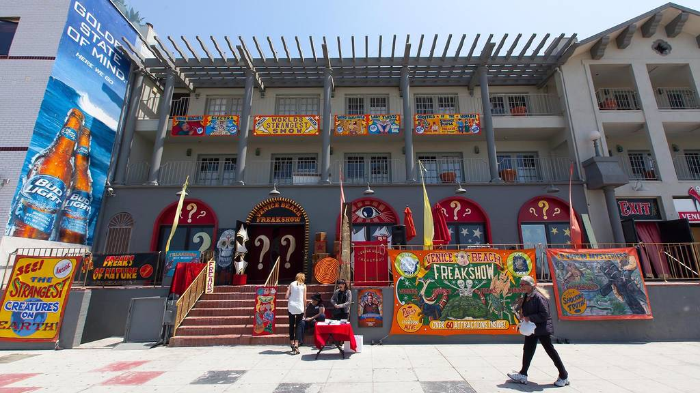
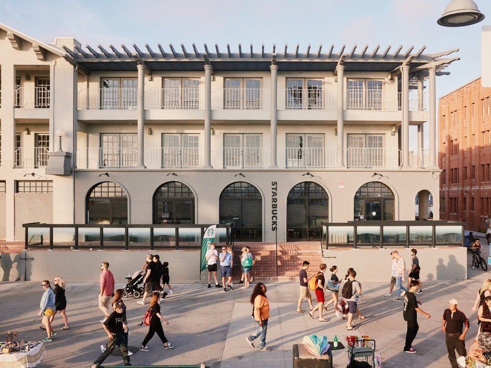

#Why I Dislike Instagram

##if you can't take the heat...

I was reading [this article](https://www.citylab.com/life/2019/03/rue-cremieux-paris-instagram-tourists-where-to-take-pictures/584164/) on Paris' famous Rue Crémieux and its Instagram problem. Per one resident: "We sit down to eat and just outside we have people taking photos—rappers who take two hours to film a video right beneath the window, or bachelorette parties who scream for an hour. Frankly, it’s exhausting."

On the one hand, I commiserate - it would be unpleasant to live on or near Times Square, Venice Boardwalk, Rue Crémieux, Notting Hill/Portobello Road, etc. Tourists make it a point to take pictures outside your homes, people shoot music videos in the streets, etc. - exhausting.

On the other hand, it's a picturesque or famous street in a large city - yeah, you're gonna get a lot of visitors! If you're young/up and out late/can hang, great. If not, you'll have to move somewhere else in the city. Sucks, but it's not the biggest deal, and most likely you'll make a nice chunk of change moving if you own, or step your rent down considerably if you don't.

In big cities this dynamic has been at play for years. My dad used to live on Venice Boardwalk in the 60s when he first moved out to LA from the east coast. Back then it was a few condos, shops, and apartments on the beach. Then it continued to grow up alongside the rest of LA, with many residents, artists, and entrepreneurs setting up commercial shops and stalls along the beachside walk to entertain a growing stream of beachgoers and tourists alike.

(An aside - my favorite growing up was the [Venice Beach Freakshow](https://www.laweekly.com/r-i-p-venice-beach-freakshow/) - which closed in 2017 when Snapshot Partners LLC acquired the leasehold interest in the building. Apparently Snapchat (not related to Snapshot LLC but renting a unit in the same building) had also acquired a fair amount of Venice Boardwalk property through 2017, but is now [selling or leasing](https://www.nytimes.com/2019/08/23/style/snapchat-venice-resistance.html) most of it to consolidate HQ in a Santa Monica businesspark.)

In my mind, it is inevitable that affluent individuals will find desirable locations and change their look and feel. In many cases this can lead to an economic boom combined with a cultural drought. The residents and artists who made it what it was will leave or be displaced, unless there are strict regulations keeping the market illiquid and the developers out.

In a word - gentrification. "The transformation of neighborhoods from low rent value to high rent value". But usually as new affluent landowners move in and create new economic opportunities

If you can't take the heat, and your local government isn't going to [turn down the heat](https://www.citylab.com/equity/2019/06/berlin-rent-freeze-senate-vote-affordable-housing/592051/), it might be time to make your way out of the kitchen to cooler climes.

##tourism, ads, instagram, oh my!

In the Venice example

Instagram is the most powerful discovery tool for tourists to find places like Rue Crémieux. What was once the job of the newspaper ad, magazine, TV show,

But what about the *non-urban* landscapes? The loca

Instagram is the most powerful discovery tool for tourists to find places like Rue Crémieux. What was once the job of the newspaper ad, magazine, TV show,

Advertising was once confined. Instagram has unleashed it into places it should not be. Places where it can damage fundamental connections, such as our connection to the earth, and our connection to one another as friends and family.

instagram influencing is now a business. it's advertising without the clear disclaimers or statements for who is paying for that advertising and why

a lot of this advertising requires traveling to cool/famous/chic/rugged locations and taking photos or videos there, so that followers feel they are also there, and get to see a cool place through the eyes of their "friends"

it's more than just social points gamification, it's a business, it's advertising with real money involved, and these natural settings are becoming the new ad studios that it's cool to shoot in (besides places like venice beach and rue cremieux)

and when businesses/money get involved, the natural respect for the environment/others using the space disintegrates in the face of profit and time maximization 

[Rue Cremiuex]: https://www.citylab.com/life/2019/03/rue-cremieux-paris-instagram-tourists-where-to-take-pictures/584164/) this article]